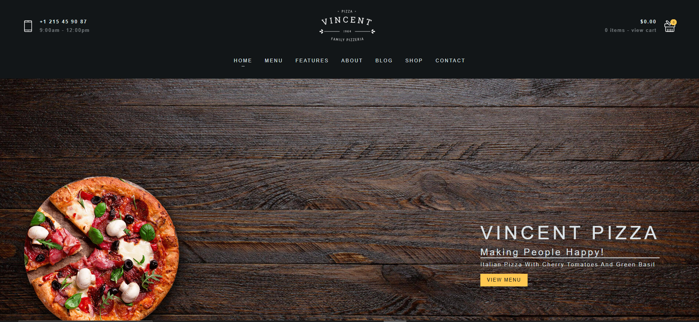
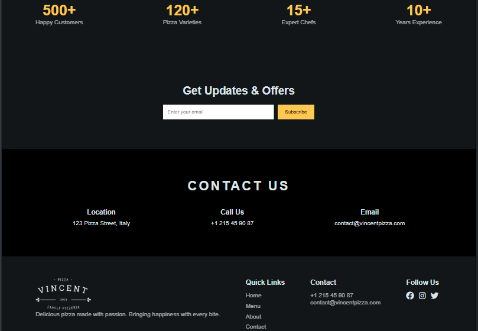

## Vincent Pizza – Responsive Landing Page

## About

Vincent Pizza is a modern, responsive food landing page built with a clean dark-themed UI and structured layout.

This project focuses on creating a visually appealing pizza website using pure HTML, CSS, and JavaScript. It highlights real-world UI practices like section structuring, responsive grids, consistent spacing, animations, and modern footer design.

Originally started as a basic landing page, the project has been expanded into a full multi-section website including menu, gallery, testimonials, and contact sections.

This project will continue to evolve with more interactive features and UI enhancements.

---

## Features

Responsive navigation bar with mobile menu

Hero section with modern layout

Interactive menu section with hover effects

About section with structured content

Special offers section

Why Choose Us (features section)

Customer testimonials section

Gallery section

Stats / achievements section

Contact information section

Modern multi-column footer

Scroll animations

Responsive grid & flex layouts

Mobile-first responsive design

---

## Project Structure / Components

Navbar: Top navigation with responsive menu toggle
Hero Section: Main landing banner
Menu Section: Pizza cards with interaction
About Section: Brand information
Offers Section: Promotional banner
Features Section: Key highlights
Testimonials: Customer reviews
Gallery: Visual content grid
Stats Section: Business highlights
Contact Section: Contact details
Footer: Modern responsive footer
Responsive CSS: Media queries for all devices

---

## Screenshots

### Desktop View

---

## Technologies Used

HTML5
CSS3
JavaScript (Vanilla JS)
Git & GitHub

---

## Learning Outcome

Building a complete multi-section landing page

Using Flexbox and Grid for real layouts

Handling responsive design across devices

Fixing layout alignment and spacing issues

Implementing scroll animations

Designing modern UI components

Creating a structured and scalable CSS system

Deploying projects using GitHub Pages

---

## Notes

This project focuses on frontend UI and layout design only.

It is a learning-based project without backend functionality.

The website has been enhanced with multiple sections, animations, and a redesigned modern footer.

Future updates will include advanced UI interactions, better animations, and more dynamic features.
